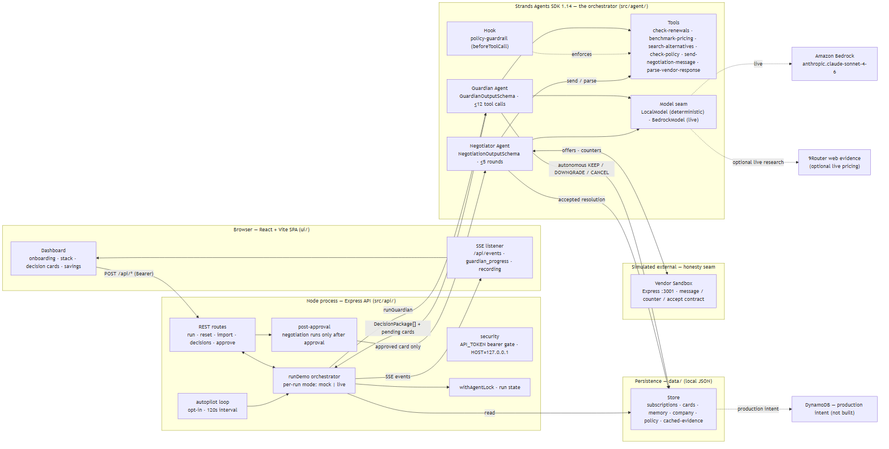
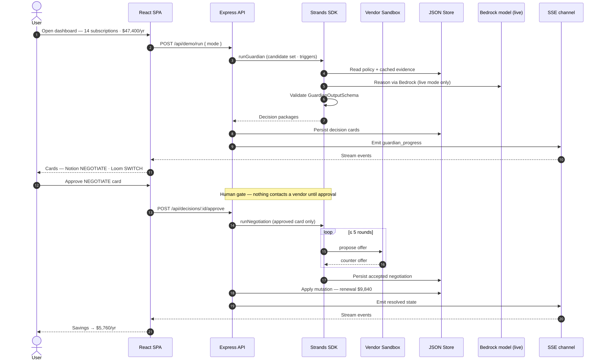

# Savr

**Savr is an autonomous procurement employee for companies without a procurement team.**

A 5–20 person startup spends $40k–$60k/year on SaaS across 15–30 tools. Nobody owns procurement. Renewals happen when someone remembers them. Prices creep up silently. Seats go unused. Nobody has time to negotiate.

Savr runs in the background and fixes this.

## What Savr Does

- **Guardian** — Continuously monitors your SaaS stack. Flags renewals, unused seats, overlapping tools, and price increases. Benchmarks market pricing. Recommends actions with evidence.
- **Negotiator** — Engages vendors in structured rounds when Guardian recommends NEGOTIATE. The LLM handles strategy and language; code owns financial boundaries.
- **Human Gate** — NEGOTIATE and SWITCH always require human approval. KEEP, DOWNGRADE, and CANCEL run autonomously. Policy is deterministic and authoritative — the agent never violates your rules. A NEGOTIATE card that passes the human gate only then authorizes the Negotiator to contact the vendor; if the negotiation does not reach an accepted agreement, the approval is refused and no mutation is applied.
- **Security** — The API binds to `127.0.0.1` by default. State-changing routes (imports, resets, approvals, demo runs, debug negotiation) require a bearer token when the deployment sets `API_TOKEN`; debug negotiation routes are additionally compiled out unless `DEBUG_MODE=true` is set. See [Deployment](#deployment).

## Architecture

See `docs/01-architecture.md`.





Diagram sources (editable Mermaid): [`docs/architecture.mmd`](docs/architecture.mmd) ·
[`docs/architecture-sequence.mmd`](docs/architecture-sequence.mmd).

Core loop: **Observe → Reason → Propose → Policy Check → Execute or Human Gate → Persist**

The LLM decides what to do. Code decides what it is allowed to do. Human decides what requires human authority.

## Why Strands

Built with the Strands Agents SDK for TypeScript (`@strands-agents/sdk@1.14.0`).

| Strands Feature | What It Does in Savr | What You See |
|----------------|---------------------|-------------|
| **Strands Agent** | Orchestrates Guardian and Negotiator modes | Agent running autonomously |
| **Custom tools** | 6 tools for renewal checks, pricing, alternatives, negotiation, policy | Agent researching and negotiating |
| **Tool calling** | Agent picks tools during reasoning (12-call limit) | Agent deciding what to research |
| **Structured output** | LLM emits `GuardianOutput`/`NegotiationOutput` via Zod; app code builds DecisionPackage/DecisionCard | Consistent, validated recommendations |
| **Hooks** | `BeforeToolCallEvent` policy guardrails | Blacklist blocked, price bounds enforced |
| **State** | `appState` (policy/config), `invocationState` (current evaluation) | Agent tracking its current task |
| **Persistence** | Procurement Memory (local JSON) | Agent remembers decisions across runs |

## Stack

- **Strands Agents SDK** `@strands-agents/sdk@1.14.0`
- **Amazon Bedrock** — Claude Sonnet 4.6 (`anthropic.claude-sonnet-4-6`, `us-east-1`)
- **Node.js 22+ / TypeScript 5.x**
- **React / Vite** — UI
- **Express** — API + vendor sandbox
- **SSE** — real-time UI events
- **Local JSON** — persistence (`data/*.json`); DynamoDB is the production intent, not implemented in this submission
- **Zod** — structured-output validation

## Build

```bash
npm install
npm --prefix ui install    # UI dependencies (needed for ui:* scripts and rebuilds)
npm run demo:test          # L5 acceptance E2E: seed → guardian → cards → approve → negotiate → savings = 5760
npm run validate:data      # Validate synthetic data (14 subs, $47,400, 32 unused seats)
npm run guardian           # Run the Guardian loop
npm run negotiate          # Run Guardian + Negotiator
npm run sandbox            # Start vendor sandbox (port 3001)
npm run dev                # Start API + built UI (port 3000)
npm run demo:reset         # Reset to initial state
npm run demo:run           # Run canonical demo pipeline (synchronous)
```

The built UI is committed at `ui/dist`, so `npm run dev` serves the full app with no
extra steps. Rebuild with `npm run build:ui`.

### Deployment

The API binds to the loopback interface by default (`HOST=127.0.0.1`). To serve the
API beyond loopback (Docker, hosted backend), set `HOST` explicitly **and** configure
`API_TOKEN` — every state-changing `/api` route then requires
`Authorization: Bearer $API_TOKEN` and rejects otherwise. Debug negotiation routes
are only registered when `DEBUG_MODE=true`.

**Autonomous trigger (opt-in):** `AUTOPILOT_ENABLED=true npm run dev` — Guardian re-runs
on its own every `AUTOPILOT_INTERVAL_MS` (default 120s) and surfaces anything newly
flagged (autopilot_check SSE). It is **off by default** so a dev server never makes
unsolicited Bedrock calls.

See `AGENTS.md` for build levels.

> AWS prereqs (live mode only): credentials with Bedrock access (Sonnet 4.6, `us-east-1`). The deterministic demo runs fully offline with `DEMO_MODE=true`. One-time account setup (budget alert, least-privilege IAM) is in `docs/07-build-plan.md` → "AWS Cost Guardrails".

#### Deploying to AWS (EC2 t3.micro — verified)

One always-on EC2 t3.micro (free tier) runs the whole app: a Node process serves
both the API and the built UI. The full runbook is `docs/09-deployment.md` and the
instance bootstrap is `infra/ec2-user-data.sh` (clone → `npm ci` → generate a demo
token → rebuild the SPA with it baked in → systemd unit). Launch steps:

1. EC2 console → Launch instance → **Amazon Linux 2023**, **t3.micro**.
2. Security group: SSH (22) from your IP + **Custom TCP (3000) from `0.0.0.0/0`**.
3. Advanced details → User data → paste `infra/ec2-user-data.sh`.
4. Allocate an **Elastic IP**, attach it, and the judge URL is `http://<IP>:3000/`.

The demo token is generated at boot (`sudo cat /root/savr-token.txt`) and baked
into the served SPA, so the public UI can click Run/Approve while state-changing
API routes stay bearer-gated.

> Public SPA note: once `HOST=0.0.0.0`, every state-changing `/api` POST needs
> `Authorization: Bearer $API_TOKEN`, and the browser has to present it. The token
> is baked into the served bundle at boot; the committed `ui/dist` stays token-free
> for local development.

**Live Bedrock on the public instance (optional):** the demo above runs
deterministically offline (zero Bedrock cost). To also exercise the real model, do
the one-time IAM grant in `docs/09-deployment.md` §0 (a least-privilege
`bedrock:InvokeModel*` inline policy for `anthropic.claude-sonnet-4-6`) and switch
the instance to `DEMO_MODE=false` — the Guardian/Negotiator loop then runs on real
Claude Sonnet 4.6 over the same Strands orchestration.

#### Deploying to AWS — ECS Fargate (alternative, containers)

Container path: same IAM grant, then ECR image + one CloudFormation stack (ALB +
Fargate service + roles). Full runbook in `infra/`.

```bash
# 1. Build, tag, push the image (token baked into the bundle)
DEMO_TOKEN="$(openssl rand -hex 24)"
aws ecr create-repository --repository-name savr || true
aws ecr get-login-password --region us-east-1 | docker login --username AWS --password-stdin \
  <ACCOUNT>.dkr.ecr.us-east-1.amazonaws.com
docker build -f infra/Dockerfile --build-arg VITE_API_TOKEN="$DEMO_TOKEN" -t savr:latest .
docker tag savr:latest <ACCOUNT>.dkr.ecr.us-east-1.amazonaws.com/savr:latest
docker push <ACCOUNT>.dkr.ecr.us-east-1.amazonaws.com/savr:latest

# 2. API token secret (the request gate; the task role fetches it)
aws secretsmanager create-secret --name savr/api-token \
  --secret-string "{\"API_TOKEN\":\"$DEMO_TOKEN\"}"

# 3. Deploy the stack, then hit the URL from the Outputs (AppUrl)
aws cloudformation create-stack --stack-name savr \
  --template-body file://infra/cloudformation/deploy.yaml \
  --parameters \
    ParameterKey=ImageUri,ParameterValue=<ACCOUNT>.dkr.ecr.us-east-1.amazonaws.com/savr:latest \
    ParameterKey=VpcId,ParameterValue=vpc-<default-vpc> \
    ParameterKey=SubnetA,ParameterValue=subnet-<a> \
    ParameterKey=SubnetB,ParameterValue=subnet-<b> \
    ParameterKey=ApiTokenSecretArn,ParameterValue=arn:aws:secretsmanager:us-east-1:<ACCOUNT>:secret:savr/api-token-<suffix> \
    ParameterKey=DemoMode,ParameterValue=true \
  --capabilities CAPABILITY_IAM
```

In-process autopilot (`AutopilotEnabled=true`) or an EventBridge schedule aimed at
an `ecs run-task` can trigger the Guardian "runs on its own" story. Cost ≈ $20–25/mo
per task + Bedrock tokens; remove with
`aws cloudformation delete-stack --stack-name savr`.

If a deploy attempt eats time, the app runs identically locally with
`DEMO_MODE=true`; deployment is a stretch bonus, never a blocker for the demo.

## Security

`.env` is gitignored and never committed. Copy `.env.example` → `.env` and fill in real
values. If a credential has ever been pushed or shared, **rotate it** in the AWS console
immediately. The demo itself (`DEMO_MODE=true`) runs without any AWS credentials.

## Demo

**Video:** TODO — record a ≤5-min demo (script and timings in `tasks/L5-demo-submission.md`). The UI's **Replay** button replays the canonical run at narrative pacing for recording.

**Flow:** Reset → Run → Guardian flags Notion NEGOTIATE + Loom/Veed SWITCH → "2 actions need your approval" → Approve Notion (the Negotiator then engages the vendor: 3 rounds $10,800→$10,200→$9,840) → Approve Loom → Savings counter: **$5,760/yr** → "All actions resolved."

For the "runs on its own" shot: `AUTOPILOT_ENABLED=true AUTOPILOT_INTERVAL_MS=45000 npm run dev`, then watch Guardian flag a renewal unprompted.

## What Is Simulated

- **Vendor negotiations** use a sandbox (`src/sandbox/`). Same API contract production would use; the vendor is simulated because real enterprise sales cycles take days or weeks.
- **Web research** uses cached evidence (`data/cached-evidence.json`) in demo mode. Live search is a stretch feature.
- **Procurement Memory** persists to local JSON (`data/memory.json`, `data/cards.json`). DynamoDB is the production intent, not implemented in this submission.
- **The data** is synthetic (Acme Corp, 18 employees, 14 SaaS tools). The agent's behavior on this data is real.

## Stack Import

Savr accepts a company stack as JSON matching the `Subscription` type (`POST /api/stack/import`). The demo ships with Acme Corp seeded, but the import endpoint exists so the schema is the product boundary, not hardcoded data.

## License

MIT

---

**Hackathon:** Built for the AWS AI Hackathon. Strands Agents SDK required and used. Public repo, English materials, AWS Builder ID verified. Blog post (optional bonus): "Agents for Humans" title if published.