# 01 — Architecture

## The Agentic Control Loop

```
Observe → Reason → Propose → Policy Check → [Execute | Emit Card] → Persist
```

1. **Observe** — Load subscriptions, memory, and policy. Build candidate set from all triggers.
2. **Reason** — LLM assesses evidence, selects tools, evaluates candidates.
3. **Propose** — LLM recommends an action with reasoning and evidence.
4. **Policy Check** — Deterministic code validates against policy. Blocks violations.
5. **Execute or Emit Card:**
   - If action is autonomous (KEEP, DOWNGRADE, CANCEL) AND policy allows → `executeAction()` runs immediately.
   - If action requires approval (NEGOTIATE, SWITCH) → emit `DecisionCard`, persist, pause agent.
6. **Persist** — Write results to Procurement Memory.

**Critical separation:**
- The LLM decides **what to do**.
- Code decides **what it is allowed to do**.
- Code executes **autonomous actions**.
- The human decides **what requires human authority**.

## Mode Selection

Mode (`"mock" | "live"`) is a parameter passed into `runGuardian` and `runNegotiation`
at call time, never a global read of `process.env.DEMO_MODE`. `createModel(mode)` takes
the mode explicitly and returns `LocalModel` for `"mock"`, `BedrockModel` for `"live"`.
`.env`'s `DEMO_MODE` is removed as a decision input; `AWS_REGION` and credentials remain
env-supplied since they're deployment config, not a per-request choice. This is what
allows one running server to serve both the Mock walkthrough and a Live onboarding
session without a restart.

## Candidate Selection

The Guardian does NOT only check renewals. It evaluates the **entire stack** for any relevant trigger:

```
┌─────────────────────────────────────────────────────┐
│              SUBSCRIPTION INVENTORY                  │
│                  (all 14 entries)                    │
└──────────────────────┬──────────────────────────────┘
                       │
          ┌────────────┼────────────┬──────────────┐
          ▼            ▼            ▼              ▼
    ┌──────────┐ ┌──────────┐ ┌──────────┐ ┌──────────────┐
    │ Renewal  │ │ Unused   │ │ Category │ │ Price        │
    │ Check    │ │ Seats    │ │ Overlap  │ │ Increase     │
    │ (≤30d)   │ │ (<50%)   │ │ Detection│ │ Detection    │
    └────┬─────┘ └────┬─────┘ └────┬─────┘ └──────┬───────┘
         │            │            │               │
         └────────────┴────────────┴───────────────┘
                          │
                   CANDIDATE SET
                  (subscriptions with
                   at least one trigger)
                          │
                          ▼
                    Guardian Loop
                  (evaluates each
                   candidate)
```

**Trigger types:**
- `renewal_soon` — `renewalDate - today <= renewalWindowDays`
- `unused_seats` — `seatsActive / seatsPurchased < unusedSeatThresholdPct` (seat-based only)
- `category_overlap` — Another active subscription in the same category **and at least one member of the overlap pair already has a base trigger** (renewal_soon, unused_seats, price_increase, or budget_anomaly). When the pair qualifies, both members are flagged; the retention target (consolidation target) is marked so the Guardian can prefer KEEP for it.
- `price_increase` — `priceIncreasePct > 0`
- `budget_anomaly` — `annualCost > policy.maxSingleVendorSpend`

**How the demo works with this model:** Veed (+90 days, outside renewal window) is flagged because it overlaps with Loom in the "Video" category, and Loom is already flagged by `renewal_soon`. The overlap trigger catches Veed even though the renewal trigger does not. Slack and Zoom both sit in "Communication", but neither has a base trigger, so the pair does not qualify for `category_overlap` — keeping the candidate set at exactly the canonical five (notion, loom, veed, notion-ai, posthog).

## Dual-Loop Model

```
┌───────────────────────────────────────────────────────┐
│                    SAVR SYSTEM                         │
│                                                        │
│  ┌────────────────────┐   ┌────────────────────┐      │
│  │   GUARDIAN          │──▶│   NEGOTIATOR       │      │
│  │   (passive,         │   │   (active, invoked  │      │
│  │    scheduled)       │   │    when NEGOTIATE   │      │
│  │                     │   │    recommended)      │      │
│  └─────────┬──────────┘   └─────────┬──────────┘      │
│            │                        │                  │
│            ▼                        ▼                  │
│   DecisionPackage[]          DecisionCard              │
│            │                        │                  │
│     ┌──────┴──────┐                ▼                  │
│     │             │       ┌────────────────┐          │
│     │  execute    │       │  HUMAN GATE    │          │
│     │  Action()   │       │  approve /     │          │
│     │  (autonomous│       │  reject        │          │
│     │   actions)  │       └───────┬────────┘          │
│     │             │               │                   │
│     └──────┬──────┘               ▼                   │
│            │         ┌──────────────────────────┐     │
│            └────────▶│    PROCUREMENT MEMORY     │     │
│                      │   (local JSON)           │     │
│                      └──────────────────────────┘     │
└───────────────────────────────────────────────────────┘
```

**Guardian:**
Runs on a schedule. This build runs it on an in-process server-side timer (default
120s, enabled only when `AUTOPILOT_ENABLED=true`); EventBridge/cron is the production
intent and is deliberately not deployed here (DECISIONS #044). Loads all subscriptions.
Builds candidate set from triggers. For each candidate, the LLM reasons about evidence
and recommends an action. Application code computes estimated savings, checks policy,
and either executes autonomously or emits a DecisionCard.

**Negotiator:**
Invoked when Guardian recommends NEGOTIATE and policy allows. Runs structured rounds with the vendor sandbox. When complete, emits a DecisionCard with the realized savings. Pauses for human approval.

**executeAction():**
Runs autonomous actions (KEEP, DOWNGRADE, CANCEL) without human approval. Defined in `src/agent/execute-action.ts`:

```typescript
function executeAction(card: DecisionCard, subscription: Subscription): PostApprovalMutation {
  switch (card.action) {
    case "KEEP":
      return { action: "KEEP", subscriptionId: subscription.id, changes: {} };
    case "DOWNGRADE":
      return {
        action: "DOWNGRADE",
        subscriptionId: subscription.id,
        changes: {
          seatsActive: subscription.seatsActive,
          annualCost: subscription.seatsActive! * subscription.pricePerSeat!,
        },
      };
    case "CANCEL":
      return {
        action: "CANCEL",
        subscriptionId: subscription.id,
        changes: { status: "cancelled", renewalCost: 0 },
      };
    default:
      throw new Error(`executeAction called on non-autonomous action: ${card.action}`);
  }
}
```

## Deterministic vs Agentic

| Responsibility | Owner |
|----------------|-------|
| Policy enforcement | Code |
| Financial calculations | Code |
| Savings computation | Code |
| Round caps | Code |
| State transitions | Code |
| Candidate selection (triggers) | Code |
| executeAction() | Code |
| Post-approval mutations | Code |
| Tool-call limits | Code |
| Tool selection | LLM |
| Research strategy | LLM |
| Evidence assessment | LLM |
| Action recommendation | LLM |
| Negotiation language | LLM |
| Risk evaluation | LLM |

## Component Diagram

```
┌──────────┐     ┌────────────────┐     ┌─────────────────┐
│  React   │◀───▶│  Express API   │◀───▶│  Strands Agent  │
│  UI      │ SSE │  (REST + SSE)  │     │  (orchestrator) │
└──────────┘     └────────────────┘     └────────┬────────┘
                                                 │
                                       ┌─────────┼─────────┐
                                       │         │         │
┌─────▼───┐ ┌───▼───┐ ┌───▼────────┐
                                  │ Tools   │ │Memory │ │ Hooks      │
                                  │ (6)     │ │(local │ │(policy)    │
                                  └─────────┘ └───────┘ └────────────┘
                                                 │
                                           ┌─────▼──────┐
                                           │   Amazon   │
                                           │   Bedrock  │
                                           └────────────┘
```

## Strands Usage

- **Agent:** Single Strands Agent. Guardian and Negotiator are modes.
- **Custom tools:** 6 tools with explicit return types.
- **Tool calling:** Agent invokes tools during reasoning. Logged and auditable.
- **Structured output:** LLM produces `GuardianOutput` / `NegotiationOutput` via Zod schemas. Application code transforms into `DecisionPackage` / `DecisionCard`.
- **Hooks:** `BeforeToolCallEvent` runs policy guardrails. Mutates/cancels event to block tools.
- **State mapping:**
  - `appState` — policy, config, company info (persists across invocations within a session)
  - `invocationState` — currentSubscription, evidence, toolCallCount, mode (per-evaluation)
  - Local JSON files — `ProcurementMemory` (`data/*.json`), the persistence implemented in
    this build. DynamoDB via `strands-dynamodb-storage` is the production intent, not
    implemented in the submission.
- **Persistence:** Local JSON files (`data/*.json`) — implemented in this build. DynamoDB
  via `strands-dynamodb-storage` is the production intent, not implemented in the
  submission.

## Tools Table

| Tool | Signature | Purpose | Failure Mode |
|------|-----------|---------|--------------|
| `check_renewals` | `(windowDays: number) → Subscription[]` | Returns subscriptions renewing within window. | Empty array on error. |
| `benchmark_pricing` | `(category: string, vendorId: string) → BenchmarkPricingResult` | Market pricing for category. Cached in DEMO_MODE. | `{ status: "evidence_unavailable" }` |
| `search_alternatives` | `(category: string, currentVendorId: string) → SearchAlternativesResult` | Competing products. Cached in DEMO_MODE. | `{ status: "evidence_unavailable" }` |
| `send_negotiation_message` | `(vendorId: string, message: string, buyerOfferPrice: number) → SendMessageResult` | Send message + structured offer to sandbox. | `{ status: "error", error: "timeout" }` |
| `parse_vendor_response` | `(rawResponse: string) → ParseVendorResponseResult` | Extract Offer from vendor text. | `{ status: "parse_failure" }` — never invents data. |
| `check_policy` | `(action: DecisionAction, subscriptionId: string, policy: Policy, estimatedSavings: number) → PolicyResult` | Validate action against policy. Never fails. | Always returns PolicyResult. |

## Deployment

- **Model:** Amazon Bedrock, Claude Sonnet 4.6 (`anthropic.claude-sonnet-4-6`)
- **Region:** `us-east-1`
- **Node.js:** 22+
- **Strands SDK:** `@strands-agents/sdk@1.14.0`
- **TypeScript:** 5.x
- **Scheduler:** In-process `setInterval` (default 120s), enabled only when
  `AUTOPILOT_ENABLED=true` (DECISIONS #044). EventBridge cron is production intent, not
  deployed.
- **Vendor sandbox:** Express (port 3001)
- **UI:** React + Vite (port 3000)
- **Events:** SSE from Express to React
- **Persistence:** Local JSON (`data/*.json`). DynamoDB is the production intent, not
  implemented in the submission.
- **Cost guardrails:** `DEMO_MODE=true` is the default (cached evidence, local memory). Autopilot is opt-in (`AUTOPILOT_ENABLED=true`) so a dev server never makes unsolicited Bedrock calls. `SAVR_MODEL` env overrides the model for dev loops; the demo pins Sonnet 4.6. See `docs/07-build-plan.md` → "AWS Cost Guardrails".

## As-Built Component Map



(The same diagram exists as a PNG at `architecture.png`; the editable Mermaid source
is `architecture.mmd`.)

Ownership boundaries, top to bottom:

- **Browser** — React + Vite SPA (`ui/`): dashboard, onboarding screens, and an SSE
  listener that streams Guardian progress and the recorded event narrative.
- **Express API** (`src/api/`) — REST routes, the `runDemo` orchestrator (mode is a
  per-run parameter, `mock | live`), post-approval (negotiation triggered only by an
  approved card), the opt-in autopilot clock, and the bearer-token gate that every
  state-changing route requires when `API_TOKEN` is set.
- **Strands Agents SDK 1.14 — the orchestrator** (`src/agent/`) — one Agent with two
  modes (Guardian/Negotiator); six tools; the `beforeToolCall` policy guardrail hook;
  structured output (`GuardianOutputSchema`/`NegotiationOutputSchema`); and the model
  seam (`LocalModel` for deterministic mock runs, `BedrockModel` for live).
- **Honesty seams (dashed)** — the **Vendor Sandbox** (Express :3001) simulates the
  vendor's counter/accept contract; **Amazon Bedrock** (`anthropic.claude-sonnet-4-6`)
  and the optional 9Router live research path are live-mode additions; **DynamoDB**
  is marked production intent, not built.
- **Persistence** — `data/*.json` (subscriptions, cards, memory, company, policy,
  cached evidence).

## Runtime Sequence


(Editable Mermaid source: `architecture-sequence.mmd`.)

The happy path end-to-end: a user starts the review, the Guardian reads policy and
cached evidence and emits validated decision packages, the two approval-required cards
are held for the human (nothing contacts a vendor before approval), approving a card is
what authorizes the Negotiator, the sandbox plays the vendor across a bounded number of
rounds, and the accepted resolution is persisted and streamed back — ending at the
asserted **$5,760/yr** in annual savings.
